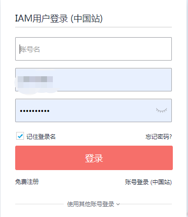
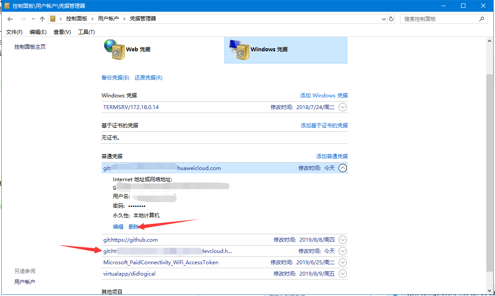
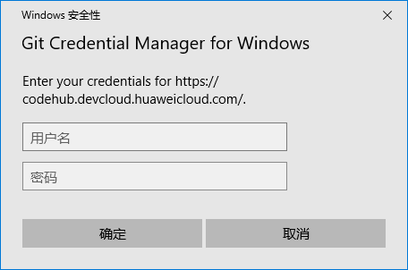

当我们的git仓库地址被更换后，我们需要操作什么呢，我以华为云和windows操作系统为例，来解释一下。小白进阶为大神就是这样一步步来的~~~
1.git仓库的地址与windows凭据有一定的关系（系统的凭据管理器其实就是一个系统组件，能够帮助完成本地访问时的认证工作。当用户第一次输入用户名和密码的时候，凭证管理器可以将这些访问凭据(用户、密码、证书等)保存在本地，再次访问该服务器站点时，系统会自动完成凭据的认证过程。）

2.在命令提示符中输入
``` bash
git remote remove origin
git remote add origin url
git remote -v
```
移除旧的仓库，切换新的仓库,确认现在的仓库地址
3.要在windows凭据中把原来的相关的都删掉，这个很重要，要不没法操作现在的仓库

4.在操作现有仓库的时候会有弹窗重新认证，按照账户名/用户名，密码的格式输入就好了。

5.完成
