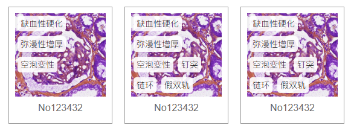
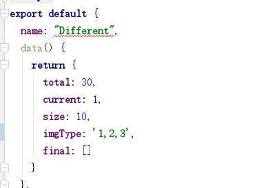
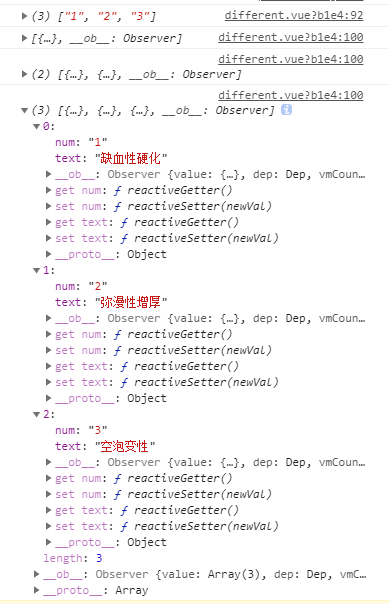

###有时候由于数据库的原因，我们的后端并不那么智能，所以有些东西需要前端来做一些处理，例如重组数据，今天遇到一个用vue重组数据的案例
后端返回的数据类似这样
``` bash
srting: '1,2,3'
```
但是前端需要的是这样的

我们需要将后端返回的数字转换为相对应的文字

``` bash
created() {
    var arr = this.imgType.split(',')
    console.log(arr)
    arr.map((item, i) => {
      var obj = {}
      obj.num = item
      obj.text = item === "1" ? '缺血性硬化':item === "2" ? '弥漫性增厚':item === "3" ? '空泡变性':item === "4" ? '钉突':item === "5" ? '链环' : '钉突'
      this.final.push(obj)
      console.log(this.final)
    })
  }
```
打印输出的结果

填充数据
``` bash
<div class="result">
  <span v-for="( item ,i ) in final " :key="i">{{item.text}}</span>
</div>
```
这样就可以了~~~
其实这里就是给拿到的数据转换为数组，在数组中挨个进行对应判断，用map进行遍历，存在的数据会重新push进一个新的数组，在html中遍历新的数组就好。
这是我目前想到的办法，如果后续有更方便的就继续更新。
